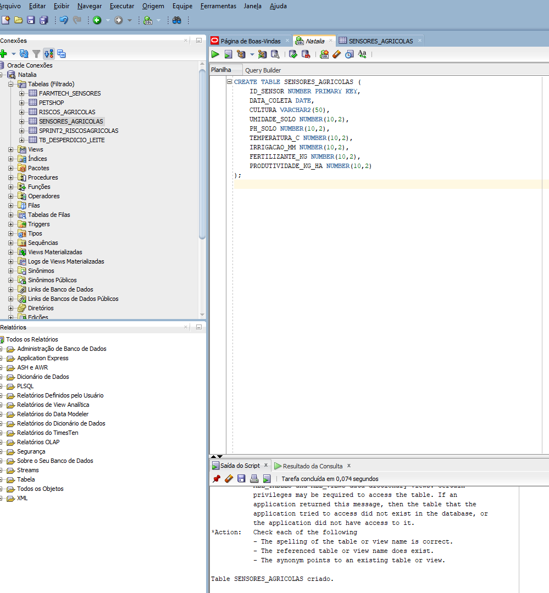
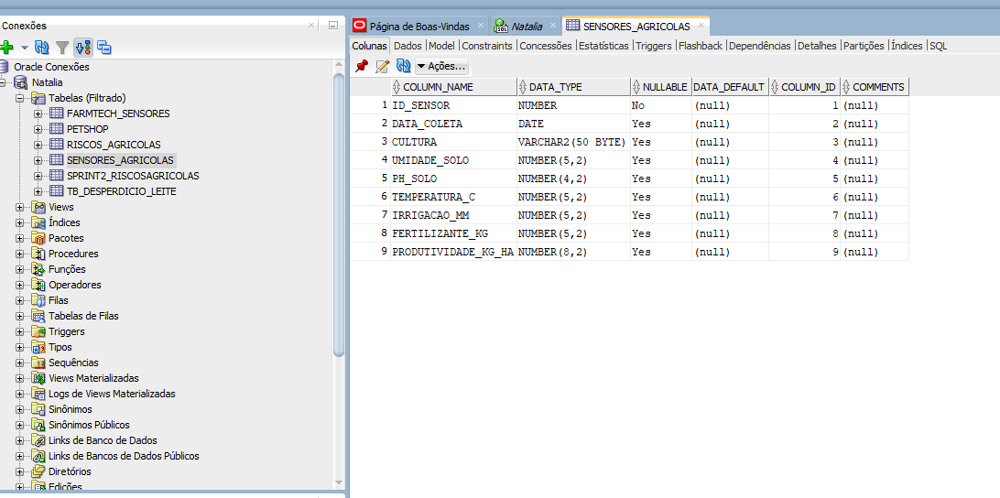
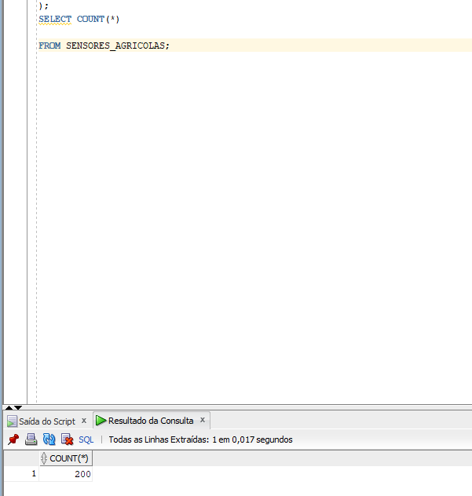
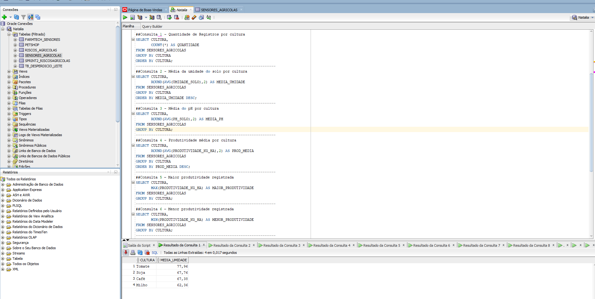
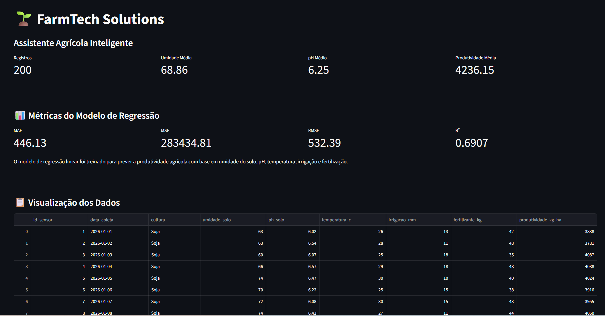
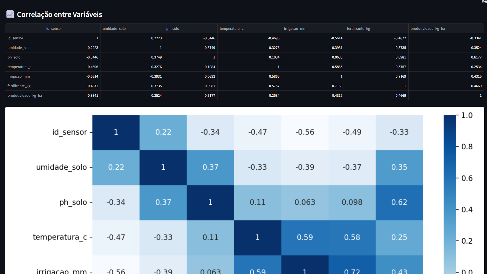
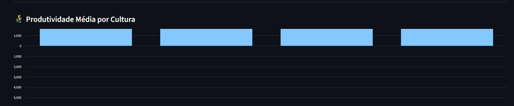
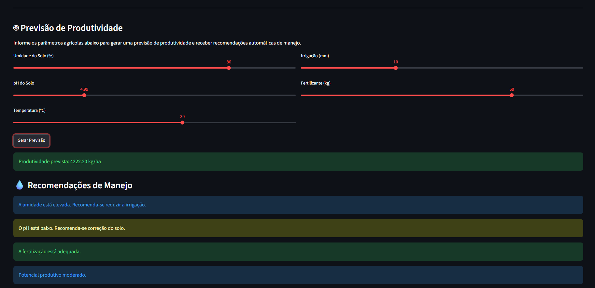

# FIAP - Faculdade de Informática e Administração Paulista

# 🌱 FarmTech Solutions - Assistente Agrícola Inteligente

---

## 👨‍🎓 Integrantes

* Natalia de Lima Faro - RM 568610

---

## 📜 Descrição

Este projeto tem como objetivo desenvolver um Assistente Agrícola Inteligente capaz de armazenar, analisar e prever informações agrícolas utilizando Banco de Dados Oracle, Machine Learning e Dashboard Interativo.

A solução foi desenvolvida utilizando dados agrícolas simulados contendo informações sobre umidade do solo, pH, temperatura, irrigação, fertilização e produtividade.

A partir desses dados, foram realizadas análises exploratórias por meio de consultas SQL, treinamento de um modelo de Regressão Linear com Scikit-Learn e desenvolvimento de um dashboard em Streamlit para visualização das informações e geração de recomendações automáticas de manejo.

O projeto demonstra a aplicação prática da Inteligência Artificial no Agronegócio, auxiliando gestores e produtores rurais na tomada de decisão baseada em dados.

---

## 📁 Estrutura de pastas

```text
FarmTech_Fase4
│
├── data
│   └── dados_agricolas_fase4.csv
│
├── database
│   └── banco.sql
│
├── docs
│   ├── criacao_tabela.png
│   ├── count.png
│   ├── sensores_agricolas.png
│   ├── testes_agricolas.png
│   ├── estrutura_projeto.png
│   ├── farmtech_solutions.png
│   ├── correlacao_variaveis.png
│   ├── produtividade_cultura.png
│   └── Previsao_Produtividade.png
│
├── models
│   └── README.txt
│
├── src
│   └── treinamento.py
│
├── streamlit
│   └── app.py
│
└── README.md
```

---

## 🔧 Como executar o código

### Pré-requisitos

* Python 3 instalado
* Oracle SQL Developer instalado
* Banco Oracle configurado
* Bibliotecas:

  * pandas
  * numpy
  * scikit-learn
  * joblib
  * matplotlib
  * seaborn
  * streamlit

### Passo a passo

Baixe ou clone o repositório.

Instale as dependências:

```bash
pip install pandas numpy scikit-learn joblib matplotlib seaborn streamlit
```

Execute o treinamento do modelo:

```bash
python src/treinamento.py
```

Execute o dashboard:

```bash
streamlit run streamlit/app.py
```

Acesse o endereço informado no terminal:

```text
http://localhost:8501
```

---

## ⚙️ Funcionalidades

* Criação de tabela Oracle para armazenamento dos dados agrícolas.
* Importação e validação de dados simulados.
* Consultas SQL analíticas.
* Treinamento de modelo de Regressão Linear.
* Cálculo das métricas MAE, MSE, RMSE e R².
* Dashboard interativo em Streamlit.
* Matriz de correlação.
* Heatmap de correlação.
* Gráfico de produtividade média por cultura.
* Previsão de produtividade agrícola.
* Recomendações automáticas de manejo.

---

## 🚀 Tecnologias Utilizadas

* Python
* Pandas
* NumPy
* Scikit-Learn
* Joblib
* Streamlit
* Matplotlib
* Seaborn
* Oracle Database
* Oracle SQL Developer
* GitHub

---

## 🗄 Banco de Dados Oracle

Foi criada a tabela `SENSORES_AGRICOLAS` para armazenar os dados utilizados no treinamento e análise do modelo.

### Criação da Tabela



### Estrutura da Tabela



### Validação da Carga

A base foi carregada com sucesso contendo 200 registros.



---

## 📊 Consultas SQL

Foram realizadas consultas utilizando:

* COUNT
* AVG
* MAX
* MIN
* GROUP BY
* ORDER BY
* WHERE

Objetivo: analisar padrões agrícolas relacionados à umidade do solo, pH, irrigação e produtividade.

### Evidências



---

## 🤖 Machine Learning

Foi desenvolvido um modelo de Regressão Linear para prever a produtividade agrícola.

### Variáveis de Entrada

* Umidade do Solo
* pH do Solo
* Temperatura
* Irrigação
* Fertilizante

### Variável Prevista

* Produtividade Agrícola (kg/ha)

### Métricas Obtidas

| Métrica | Resultado |
| ------- | --------: |
| MAE     |    446.13 |
| MSE     | 283434.81 |
| RMSE    |    532.39 |
| R²      |    0.6907 |

### Interpretação

O valor de R² igual a 0,6907 indica que aproximadamente 69% da variação da produtividade agrícola pode ser explicada pelas variáveis utilizadas no treinamento.

---

## 📈 Dashboard Streamlit

O dashboard foi desenvolvido para facilitar a visualização dos dados e auxiliar na tomada de decisão.

### Dashboard Principal



### Correlação entre Variáveis



### Produtividade Média por Cultura



### Previsão de Produtividade e Recomendações



---

## 📊 Conclusão

O projeto demonstrou a integração entre Banco de Dados, Ciência de Dados e Inteligência Artificial aplicados ao Agronegócio.

A utilização de consultas SQL, algoritmos de Machine Learning e dashboards interativos permitiu transformar dados agrícolas em informações relevantes para apoio à tomada de decisão, contribuindo para uma agricultura mais eficiente, produtiva e sustentável.

---

🎥 Vídeo Demonstrativo

A apresentação completa do projeto pode ser acessada pelo link abaixo:

🔗 YouTube: https://youtu.be/hipRESzmE34

O vídeo demonstra:

Estrutura do projeto e organização das pastas.
Criação e validação da tabela no Oracle Database.
Execução das consultas SQL analíticas.
Treinamento do modelo de Machine Learning utilizando Scikit-Learn.
Avaliação das métricas MAE, MSE, RMSE e R².
Funcionamento do dashboard desenvolvido em Streamlit.
Visualização dos dados agrícolas.
Análise de correlação entre variáveis.
Gráfico de produtividade média por cultura.
Previsão de produtividade agrícola.
Recomendações automáticas de manejo com base nos resultados obtidos.

---

## 🗃 Histórico de lançamentos

* 0.1.0 - 2026 - Criação da estrutura inicial do projeto
* 0.2.0 - 2026 - Implementação do banco Oracle e consultas SQL
* 0.3.0 - 2026 - Desenvolvimento do modelo de Regressão Linear
* 0.4.0 - 2026 - Implementação do dashboard Streamlit e recomendações automáticas

---

## 📋 Licença

MODELO GIT FIAP por FIAP está licenciado sob Attribution 4.0 International.
