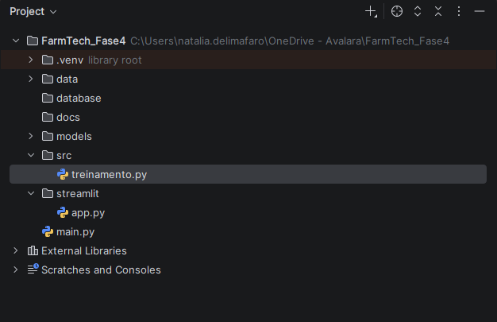

# 🌱 FarmTech Solutions - Fase 4

## Assistente Agrícola Inteligente

### 👥 Integrantes

| Nome         | RM      |
| ------------ | ------- |
| Natalia Faro | 568610 |

---

# 📌 Descrição do Projeto

A FarmTech Solutions é uma solução voltada ao Agronegócio que integra Banco de Dados, Ciência de Dados e Inteligência Artificial para apoiar a tomada de decisão agrícola.

Nesta Fase 4 foi desenvolvido um Assistente Agrícola Inteligente capaz de armazenar dados coletados por sensores, realizar análises estatísticas, prever produtividade agrícola utilizando Machine Learning e fornecer recomendações automáticas de manejo através de um dashboard interativo.

---

# 🎯 Objetivos

* Armazenar dados agrícolas em banco Oracle.
* Realizar análises exploratórias utilizando SQL.
* Aplicar algoritmos de Machine Learning para previsão de produtividade.
* Gerar recomendações inteligentes de manejo agrícola.
* Disponibilizar os resultados através de dashboard Streamlit.

---

# 🛠 Tecnologias Utilizadas

* Python 3
* Pandas
* NumPy
* Scikit-Learn
* Joblib
* Streamlit
* Matplotlib
* Seaborn
* Oracle Database
* Oracle SQL Developer

---

# 📂 Estrutura do Projeto

```text
FarmTech_Fase4
│
├── data
│   └── dados_agricolas_fase4.csv
│
├── database
│
├── docs
│
├── models
│   └── modelo_produtividade.pkl
│
├── src
│   └── treinamento.py
│
├── streamlit
│   └── app.py
│
└── README.md
```

### Evidência



---

# 🗄 Banco de Dados Oracle

Foi criada a tabela `SENSORES_AGRICOLAS` para armazenamento dos dados agrícolas.

## Estrutura da Tabela


---

# 📊 Consultas SQL

Foram realizadas consultas utilizando:

* COUNT
* AVG
* MAX
* MIN
* GROUP BY
* ORDER BY
* WHERE

Objetivo: analisar padrões relacionados à umidade do solo, pH, irrigação e produtividade agrícola.

### Evidências


### Validação da Base

A carga foi realizada com sucesso contendo 200 registros.


---

# 🤖 Machine Learning

## Modelo Utilizado

Regressão Linear (Linear Regression)

### Variáveis de Entrada

* Umidade do Solo
* pH do Solo
* Temperatura
* Irrigação
* Fertilizante

### Variável Alvo

* Produtividade Agrícola (kg/ha)

---

## Métricas Obtidas

| Métrica | Resultado |
| ------- | --------: |
| MAE     |    446.13 |
| MSE     | 283434.81 |
| RMSE    |    532.39 |
| R²      |    0.6907 |

### Interpretação

O modelo apresentou R² de 0,6907, indicando que aproximadamente 69% da variação da produtividade agrícola pode ser explicada pelas variáveis utilizadas no treinamento.

---

# 📈 Dashboard Streamlit

O dashboard permite:

* Visualização dos dados agrícolas;
* Indicadores gerais;
* Métricas do modelo;
* Matriz de correlação;
* Heatmap de correlação;
* Gráfico de produtividade por cultura;
* Previsão de produtividade;
* Recomendações automáticas de manejo.

---

## Dashboard Principal


---

## Correlação entre Variáveis


---

## Produtividade Média por Cultura


---

## Previsão e Recomendações


---

# 💧 Recomendações Inteligentes

O sistema realiza recomendações automáticas considerando:

* Ajuste de irrigação;
* Correção do pH do solo;
* Fertilização;
* Potencial produtivo.

---

# ▶️ Como Executar o Projeto

## Instalar Dependências

```bash
pip install pandas numpy scikit-learn joblib matplotlib seaborn streamlit
```

## Executar Treinamento

```bash
python src/treinamento.py
```

## Executar Dashboard

```bash
streamlit run streamlit/app.py
```

---

# 🎥 Vídeo Demonstrativo

Inserir aqui o link do vídeo de apresentação da atividade.

Exemplo:

```text
https://youtu.be/SEU_VIDEO
```

---

# 🏫 FIAP

Projeto acadêmico desenvolvido para a disciplina de Sistemas Computacionais aplicados ao Agronegócio.

**Fase 4 – Assistente Agrícola Inteligente**
